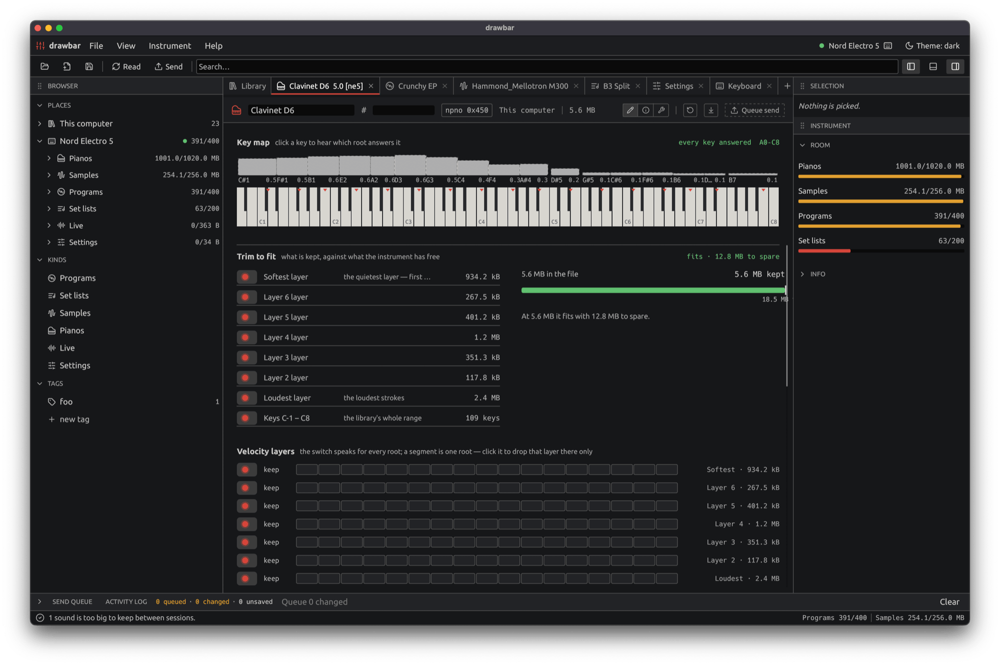

# drawbar

An [egui](https://github.com/emilk/egui) app over
[`nord-format`](../nord-format) and [`nord-usb`](../nord-usb) — everything
[`nord-cli`](../nord-cli) can do that is worth a window, reachable from a browser
tab or a desktop one.



The window is a file browser over the places your sounds live: files on this
computer — dropped, opened, pulled off the instrument, or made fresh — beside an
attached instrument's own folders, so moving a sound between the two is a short
drag. Anything you open becomes a document with a **Basic** face laid out like the
front panel and an **Advanced** face that is the whole body as a table. Edits to
something read off the instrument are held as pending until you send them back.

## Usage

```sh
nix run .#drawbar            # the desktop app
nix run .#drawbar-web        # drawbar in the browser
```

Both open the same window: the sidebar with **Open…**, **New** and **Connect
instrument**, a tab per open document, and a status strip that expands into the
activity log. The user guide walks through it:

- [Using drawbar](https://jmoo.github.io/drawbar/docs/drawbar/overview.html) — the
  window, this computer, the instrument, and the two document faces.
- [Build and run](https://jmoo.github.io/drawbar/docs/drawbar/build.html) — the
  native and web builds in full, and browser support.

## Build and test

From `crates/` inside the development shell:

```sh
cargo run -p drawbar
cargo test -p drawbar
```

`nix build .#drawbar-web` produces the whole servable bundle — the bound wasm
module beside `index.html` — in one step. The `--target wasm32-unknown-unknown`
builds must run from `crates/` or below, because `crates/.cargo/config.toml`
supplies the `--cfg=web_sys_unstable_apis` that WebUSB needs in `web-sys`.

## Disclaimer

Not affiliated with, authorized, or endorsed by Clavia DMI AB. "Nord", "Clavia",
and "Electro" are trademarks of Clavia DMI AB, used here only to identify the
hardware these formats come from.
