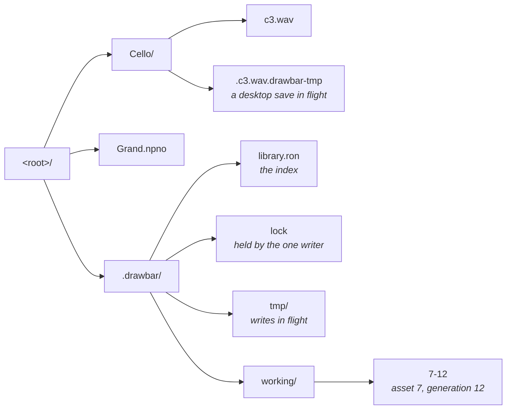
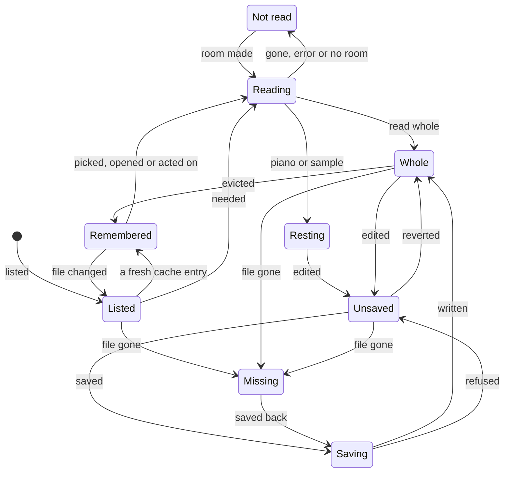
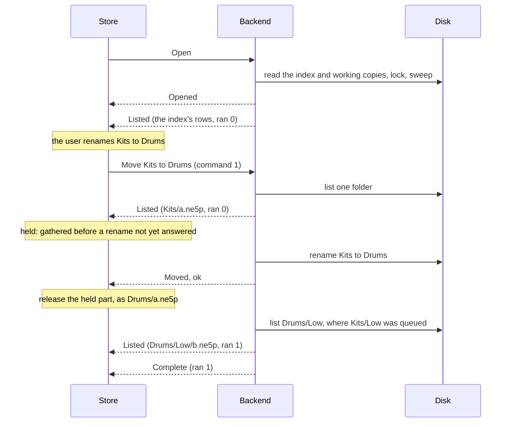
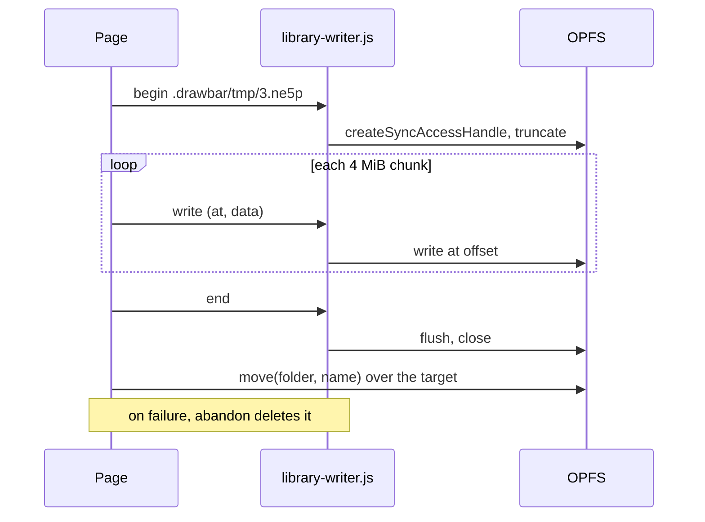
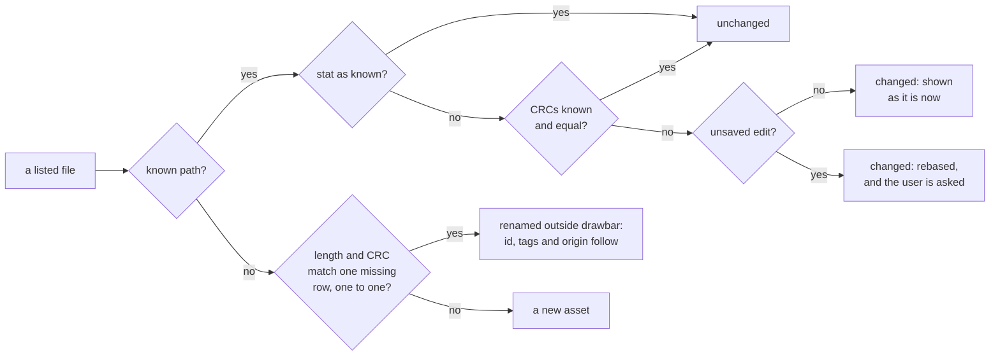
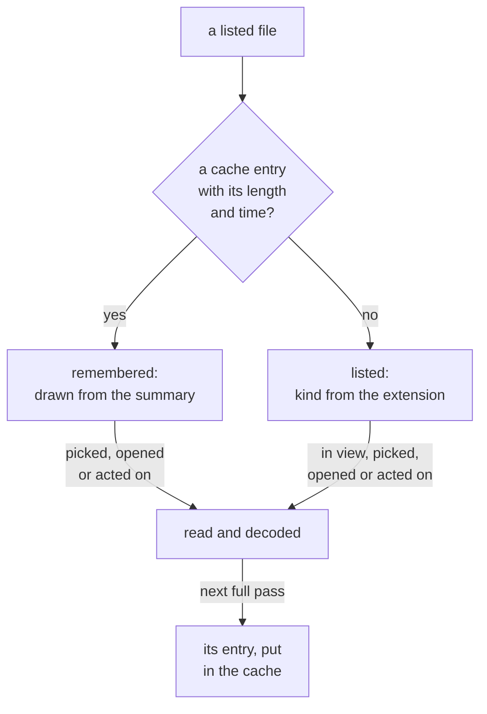

# Library data model

drawbar keeps This computer as a folder of real files. This page describes how
the app models that folder, how it reads and writes it, and how it stays
consistent with changes made outside drawbar. What a user sees of it is on
[Your files](../drawbar/this-computer.md).

The code is in `crates/drawbar/src`: `store/` holds the library on disk,
`workspace.rs` the assets in memory, `folders.rs` the folder tree, `ondisk.rs`
the files left on disk and read by range, and `summary.rs` with
`store/cache.rs` what drawbar remembers of a read between sessions.

## The library on disk

A library is a folder tree. A folder in the browser is a directory, an asset is
a file, and a move is a rename. Any folder can be opened as a library.

- **Desktop:** the default library is `library` in the folder eframe keeps the
  app's data in (`eframe::storage_dir`): `~/Library/Application Support/drawbar`
  on macOS, `$XDG_DATA_HOME/drawbar` or `~/.local/share/drawbar` on Linux. On
  Windows that folder is in the roaming app data, which a domain profile copies at
  every sign-in, so the library is `%LOCALAPPDATA%\drawbar\library` instead,
  falling back to the roaming folder when `LOCALAPPDATA` is unset
  (`store::native::default_root`).
- **Browser:** the default library is the root of the origin private file system
  (OPFS). In browsers with `showDirectoryPicker`, the user can also pick a folder
  on the computer (`store::web::Root`).

What a file cannot say lives in a hidden `.drawbar/` folder at the root:



`.drawbar/` is made at the first write, never on open, so a folder opened and
looked at stays as it was. The default library's folder is also made at its
first write.

### The index

`.drawbar/library.ron` is one [RON](https://github.com/ron-rs/ron) file,
rewritten whole, so writing it is a single commit point. It is written in id
order, so one library always serializes to the same text
(`store/sidecar.rs`).

The index holds a row only for an asset with something its file cannot say:
tags, an unsaved edit, or the slot it came off. It also holds one for a file of
a kind drawbar does not open but holds because it made the file or was given
it. Every other file is known from the listing alone, so an untouched library's
index is a few lines, and it grows with tags and edits, not with the number of
files. A row that stops holding any of these is dropped at the next write. A
field with nothing in it is not written. Abridged:

```text
(
    version: 1,
    next_id: 9,
    next_generation: 13,
    tags: {
        1: "Gig",
    },
    assets: {
        7: (
            path: Some("Cello/c3.wav"),
            fingerprint: Some((
                len: 88244,
                modified: Some(1727712000123456789),
                crc: Some(3735928559),
            )),
            tags: [1],
            working: Some((
                generation: 12,
                keeps: Bytes,
            )),
        ),
    },
)
```

| Field | Meaning |
|---|---|
| `version` | The index version. This build writes 1. |
| `next_id` | The id the next new asset takes. |
| `next_generation` | The generation the next working copy is written under. |
| `tags` | Tag names, by tag id. |
| `assets` | One row per asset that holds something its file cannot say, by asset id. |
| `path` | Where the asset's file is, `/`-joined from the root. `None` for a view of a slot kept only as a working copy. |
| `name` | The asset's name, written only for a row with no path. |
| `fingerprint` | Length, modification time in nanoseconds, and CRC-32 of the file when drawbar last read or wrote it. The CRC is `None` until something has read the whole file. |
| `tags` | Tag ids. |
| `origin` | Written only where the path does not say it: `Device(class, bank, slot)`, `Rescued(bank, slot)`, `Fresh` for a row with a path made with New, or `File(name)` for a row with no path. A row with a path and no origin came from its file; one with neither is fresh. |
| `working` | The asset's working copy, while it holds an unsaved edit: its generation, and what it keeps, `Bytes` or `Edit`. |

A path read from the index is checked on the way in: every component must be a
real name, never empty, `.` or `..`, and never holding `/`, `\` or NUL
(`store::LibPath`). The index is a file anyone can edit, and a `..` would reach
outside the library. A link would too, so on the desktop every folder a path
passes through below the root is looked at first, and one that is a link
refuses the operation as not found: an index row through one reads as missing.
A folder made a link between that look and the operation is still followed. In
the browser no handle reaches through a link: the private file system holds
none, and Chromium hides a link at any depth below a picked folder.

The version is read first, on its own. An index with a higher version opens the
library read-only and is never rewritten, so a newer drawbar's index survives an
older one being run over it. An index that does not parse also opens the library
read-only.

### Working copies, `tmp/` and `lock`

- `working/<id>-<generation>` holds an unsaved edit. A new edit gets a new
  generation, and the old file is deleted once the index stops naming it. A copy
  is rewritten only by a save of a later edit, just before the save lands (see
  [The order of a pass](#the-order-of-a-pass)). One that `keeps: Bytes` holds
  the asset's bytes whole. One that `keeps: Edit` holds an edit of a piano
  library or sample instrument resting in its file, as RON text under a version
  of its own (`rewrite::Edit::working`):

  ```text
  (
      version: 1,
      edit: Sample([
          ("name", "Vibes"),
      ]),
  )
  ```

  A sample's edit is the `path = value` sets made since it was saved, and a
  piano's is its plan (`document::piano::Plan`), the format's banks and kinds
  written by their codes. A copy of another version does not read, and opens
  the library read-only.
- `tmp/` holds the temporary files of writes in flight. On the desktop that is
  only the index's own files; a library file is staged as a hidden sibling,
  `.<name>.drawbar-tmp`, so its rename never crosses a volume. A temporary is
  made only where no entry is, after removing a stale one, so a link left at its
  name is never written through; a name taken again gives way to
  `.<name>.<n>.drawbar-tmp`. In the browser
  every write is staged in `tmp/`. It also holds a slot's occupant while a write
  to the instrument replaces it, as `nord-rescued-…`, which the open's sweep
  leaves and offers once the listing is complete.
- `lock` is held by the one drawbar that may write the library, so a second
  drawbar opens it read-only.

## The in-memory model

### The workspace and its assets

`Workspace` (`workspace.rs`) is the model the rest of the app edits. It holds
every asset as a `LocalEntity`. The fields that matter here:

| Field | Meaning |
|---|---|
| `id` | Names the asset to the index, the selection and the send queue. See [Ids](#ids). |
| `name` | Its name. While `path` is set, it is the path's last component. |
| `path` | Where its file is. `None` for a view, and for a kept asset not yet placed. |
| `origin` | Where it came from: a file, a slot, the New menu, or a rescue. |
| `bytes` | Its current bytes, a shared `Bytes`. Empty while it is unread or rests in its file. |
| `entity` | What the bytes decode to, boxed, or `None` before the decode or where it failed. |
| `saved` | Its `Baseline`: what it was last saved as. |
| `kept` | Whether it is on this computer, as opposed to a view of a slot. |
| `pending` | Whether an editor holds an edit not yet applied to `bytes`. |
| `stamp` | Distinct for every set of bytes this id has held. Bytes back to the baseline's take its stamp, so the baseline does not move and nothing is written. |
| `remembered` | While it is unread, the `Summary` a read of its file found before. See [The derived cache](#the-derived-cache). |

`Bytes` wraps an `Arc<[u8]>`. The baseline shares the allocation while the bytes
are the same, so a clean asset is held once; an edit puts new bytes in place and
never writes through the shared allocation.

A `Baseline` is what the asset was last saved as:

| Field | Meaning |
|---|---|
| `bytes` | The saved bytes, or empty where `file` or `unread` holds them. |
| `crc32` | The checksum a slot holding these bytes would report: the CRC-32 of the body without its container. `device::link` and `library::agrees` decide on it. |
| `stamp` | The stamp of these bytes. The asset is unsaved when `stamp` differs from its own, or `pending` is set. |
| `file` | The file holding these bytes, left on disk and read by range (`ondisk::OnDisk`). |
| `unread` | The file's length, while nothing has read it. |

`LocalEntity::is_unsaved` compares stamps, never bodies. Every listed row asks
it every frame, and a piano library is hundreds of megabytes.

A send that lands moves the baseline to what it sent (`Workspace::landed`). An
asset sent from the file it rests in keeps that file as its baseline, and
`Workspace::landed_file` sets the link and the write from the checksum its check
took; nothing reads the file again. An asset resting in another file by the
time the send lands, as one whose edit was saved during the send does, keeps
resting there, and its write records the checksum of what the slot took, so the
slot shows as behind. An asset that holds its bytes in memory by then takes the
sent file as its baseline again under a stamp of its own, so an edit made
meanwhile shows as unsaved.

### Ids

The workspace hands out ids from `next_id`. A row keeps its id from session to
session; a file with no row takes a new id each time the library is listed,
since nothing refers to it. `next_id` is kept in the index so a row's id is
never given to another asset. When a library opens, every row
whose id is below the workspace's `next_id` takes the next free id instead
(`Store::begin`). That happens when a view of a slot was opened first, or when
another library was open before in the same window: its views stay, and their
ids must not reach an asset of the new library. A renumbered row's working copy
is written again under the new id at the next full pass, and the old one is
dropped.

### Views and kept assets

A view is a working copy of a slot on the instrument. It is not listed, has no
file, and goes when its tab closes. `Workspace::keep` promotes one into the
list, and closing the tab of a view that holds an edit, or that waits in the
send queue, promotes it instead of dropping it.

A view that holds an edit is still kept in the index, as a row with no path and
a working copy. When the library next opens, that row comes back as a file on
this computer, placed in the root, and its working copy stays until the file is
written. When another library takes the window, the views stay in the window,
so their working copies leave the library being closed (`Store::hand_over`).

## An asset's lifecycle



- **Listed.** The asset holds its file's name, length and time, and nothing
  else. Its baseline's `unread` is set, its verify state is `Reading`, and its
  kind comes from its extension.
- **Remembered.** Still unread, but the cache holds a summary of an earlier read
  of the file, taken at the length and time it has now. It draws its kind, tag,
  slot checksum, the library it plays and its verdict from that summary, and its
  verify state is `Remembered`. A row in view does not read it.
- **Reading.** Something needs it, or the index tracks it and it is read in the
  background. A `Cmd::Read` for its file is in flight.
- **Whole.** Its bytes are in memory. They are decoded off the frame, up to eight
  jobs of 64 files or 16 MiB at once on the desktop, and one job of 16 files or
  2 MiB a frame in the browser. An act about to use the decode runs it at once
  (`Workspace::read_now`). Decoding re-encodes and compares, as for any file
  that arrives.
- **Resting.** A piano library or sample instrument stays in its file, indexed.
  Its checksum is checked off the frame, one file at a time, and until then it
  is `Checking`. A file that fails its check is not sent. On the desktop each
  resting file holds a file handle open, so the desktop raises its open-file
  limit at start (`ondisk::raise_open_files`). In the browser it holds the `File`
  snapshot the page took of it.
- **Unsaved.** Its stamp differs from its baseline's. At the next full pass its
  bytes are written to `working/` under a new generation. An edit of a resting
  asset stays an edit held over its file, and the asset stays resting until the
  save writes the file again; its working copy keeps the edit, not the bytes.
- **Saving.** Saving moves the baseline to the current bytes, and the store
  writes the baseline to the file. A baseline that rests in its file needs no
  write. A save refused because the file changed, one that failed, and one sent
  as the library turned read-only all leave the asset unsaved again.
- **Missing.** Its file went missing while it held something precious: tags, an
  unsaved edit, the slot it came off, or a place in the send queue. Nothing
  writes its file again until it is saved, and that save creates the file anew.
  A file deleted outside drawbar that holds nothing precious leaves the list.
- **Not read.** The library could not read it. It stays unread and is not asked
  for again, except for a read refused for room, which is retried once room can
  be made.

A clean asset that is evicted goes back to unread under a new stamp, and keeps
its baseline's `crc32` and a summary of what it held, so it is Remembered: it
still draws as it did and matches its slot. A change on disk to an unread file
drops that checksum and the summary, since they no longer stand for the file,
and it is Listed again.

## Listing and reading

### The metadata walk

Opening a library lists every file by its name, length and time, and reads
nothing but the files under working copies (`store/exec.rs`).

1. The index's rows are looked at first, where the index says they are, in parts
   of 256, and sent before the walk begins. A row's file that is gone lends its
   length to a set the walk checks for moved files.
2. The tree is walked breadth first, one folder at a time, so the top of a large
   tree arrives first. A file a row already found is not looked at again. Entries
   are sent in `Event::Listed` parts of 256, and the app folds in four parts a
   frame.
3. Anything under a name that starts with a dot is left out of the listing, and
   a dot folder is not entered. The `.drawbar-tmp` siblings of interrupted saves
   are gathered on the way, to be swept.
4. A listing looks at no more than 1,000,000 entries, counting files, folders and
   entries left out (`exec::MOST_ENTRIES`). A folder past that, or one that
   cannot be read, is reported as not all listed.

A file's kind is decided by its extension alone: `store::opens` matches it,
ignoring case, against the formats `nord-format` names by extension
(`formats::by_extension`) and drawbar's notes (`browser::tagged`). Any other file is listed by name only, as one of the
folder's `others`, and shown with **Show all files**.

### Lazy reads

A listed asset is read once something needs it. The workspace keeps each one
wanted with how much it is needed, and the store keeps one `Cmd::Read` in flight:
when it answers, the next goes out with the most needed of what is wanted then,
at most 32 files or 8 MiB. Nothing is asked until the cache has said what it
remembers. In order of need, these ask:

- an act that works from an asset's contents, which waits until each asset in
  `Act::reads` has been read (`browser/act.rs`), and the app, every frame, for
  what is open in a tab (`Workspace::hurry`);
- the app, once each time the selection changes, for the first 64 assets
  selected (`Workspace::select`). Each stays wanted until it is read, for as long
  as it stays selected. An act on the rest reads what it needs;
- `Workspace::in_view`, for the rows the library table draws. A row draws what is
  remembered of it, so only a row with nothing remembered is read, and a row not
  drawn this frame or the last is no longer read for it.

An asset needed this frame or the last, or selected, is not evicted.

### Background reads

Once the listing is complete and the cache has answered, and again at each full
pass, the store reads the unread files the index tracks, whole: those with tags,
a working copy or a slot they came off (`Store::fetch_tracked`). Reading them
decodes them and takes their slot checksum, so they match their slots on the
instrument before anything shows them. A remembered file is skipped, since its
summary already carries that checksum. They go 32 files or 16 MiB at a time,
and a read the user waits on runs after the batch in flight. A tracked file
whose CRC the index does not know, and that no background read will cover, has
its CRC taken alone, 64 files or 64 MiB at a time
(`Cmd::Fingerprint`), so that an outside rename keeps its row. Neither starts
a batch while a read something needs is wanted or in flight.

### The memory budget

The assets may hold at most 1 GiB of a library's files whole
(`exec::MOST_BYTES`). The count is every asset's bytes, plus its baseline's
where they are not the same allocation, plus the listed length of every read in
flight. A file resting in its file takes none of it.

Each `Cmd::Read` carries the room left. The backend reads its files in order,
and answers each one that would not fit in what is left with `Failure::Room`.
The store then makes room by evicting clean assets, the least recently needed
first, and those the index tracks only after the rest (`Store::make_room`). It
evicts nothing unless that makes the room. A background read evicts only
untracked assets.

These are never evicted:

- a view, an unsaved asset, or one with a pending edit;
- one unread already, or resting in its file;
- one needed this frame or the last, or selected;
- one in the send queue;
- one with a save in flight, a working copy, or a missing file;
- one whose path is under a rename not yet answered.

A read that cannot fit even then marks the asset not read, and it is retried,
smallest first, once room can be made.

### Reading by range

`OnDisk::open` indexes a CBIN file whose tag is `npno` or `nsmp` with
`nord_format::formats::npno::Index` or `nsmp::Index`. Those read only the
container header, the prefix and the stroke or zone directory, and give the
byte range of each stroke's audio. A piano document reads one stroke by its
range (`OnDisk::read`). A file whose index does not read is read whole, so its
decode can say why.

The index does not verify the container checksum. The resting check does, in
one streaming pass that also takes the whole file's CRC-32 for its fingerprint
(`OnDisk::verify`). Until it has, a resting file is not known to hold any
bytes (`OnDisk::holds`), and nothing takes its CRC on the frame. A file whose
stat moved is told to hold what drawbar knew by its CRC, taken in one streaming
pass (`Fs::crc`). A save, a copy over a file and a rewrite look at the file
again once the new contents are staged, just before the rename, and refuse one
whose stat moved (`exec::put`); a window of one stat and one rename remains,
since no portable rename checks what it replaces. Where the browser copies
instead of moving, the copy looks again just before it lands. A resting file changed on disk under an unsaved edit is not
read whole to keep the edit apart: the asset rests in the new file, and the
workspace makes the edit again over it (`rewrite::Edit::over`). An edit the new
file already holds is let go. One that no longer applies is kept as it was,
still unsaved, and refuses to be saved, sent or copied until it is edited again
or reverted. On the desktop the handle follows the file through a rename, and
reads whatever the file holds now if it is rewritten in place; a rescan notices
that and indexes it again.

In the browser a read answers only later. The indexes read through a reader
over the slices fetched so far (`ondisk::Slices`), which reports the file's
real length and fails naming the range it lacks; the backend fetches that range,
at least 64 KiB of it, and reads the index again. A piano's index arrives in one
fetch after the 12 bytes that say what the file is, and a sample's in about one
fetch per stroke. A read on the frame of a stroke not fetched yet answers
`WouldBlock` and fetches it, and the repaint when it lands plays it. A pass over
the whole file, the checksum or a whole read, streams 4 MiB slices in a task of
its own. A `File` snapshot fails to read once its file is written, so a move this
tab makes takes the snapshot again where the file went, and a file written over
is indexed again.

A file from outside, dropped or picked with File ▸ Open…, is copied into the
library by `Cmd::Import` and never held (`Act::Take`). Its asset waits unread
until the copy lands (`Workspace::arrive`), then rests where it is a piano or
sample instrument and is read on demand otherwise. A name already taken asks, as
a rename does: Overwrite copies over the file there (`Act::TakeOver`), with the
same check a save makes, and Keep both copies under a free name. A copy whose name
something took first is placed again, and one that fails, as at a library that
turns read-only, is read into memory instead. On the desktop the copy streams
into a hidden sibling and is linked into place; in the browser the page slices the
`File` and hands each slice to the writer, or to the picked folder's writable
stream, without passing it through the tab's memory. The browser catches a drop on its way to the canvas
(`dropped.rs`), since eframe reads a dropped file whole, and lands it in the
folder whose tree row it fell on. The desktop windowing reports no drop point, so
there a drop lands at the top level unless the pointer moved over the window while
the files hovered.

A sample's document draws from the index's outline, and an open zone reads its
own stroke's range. An edit of it is held over the file as the sets made since
it was saved, and the outline they make (`document::sample::Edits`). A piano
plan over a resting library is checked against the index's stroke directory,
which carries each stroke's range. Either way the workspace holds the edit, as
the sets or the plan (`rewrite::Edit`), and the rewrite that saves it into the
file the asset rests in (`Workspace::hold_edit`, `rewrite.rs`). An editor takes
up the workspace's edit wherever the asset rests in a file its own edit was not
made over. A save sends
`Cmd::Rewrite`: the backend writes the file again from itself into a temporary,
then puts it over the file, and the asset rests in what it wrote. A sample's
copy splices the edited sections in and restates the checksum
(`cbin::Patch::copy`); a piano's is laid out by `npno::Library::write_from`,
which reads one kept stroke at a time by its range. In the browser the copy is
laid out first as the ranges of the file it keeps and the bytes the edit holds,
recording a piano's layout with a writer that keeps each stroke's range rather
than its audio, and each range is sliced from the `File` and handed to the
writer; a piano's checksum is taken as the copy streams (`cbin::Verifier::seal`)
and written last. A sample's copy checks its checksum as it streams, so a file
changed since its index was read is refused. A piano's copy reads the file's
prefix and stroke directory again first (`npno::Index::still_matches`), and
refuses one that is not the directory its index read; its audio is not compared. Either kind is refused
where the file's stat moved while the copy was written. Nothing is put over the
file then. In the browser a file written since its `File` was taken fails to
read at all. An export or send of an asset holding such an edit waits for it to be
saved first. An edit held this way is kept across a quit as a working copy of
the edit itself, and the next open makes it again over the file.

Duplicate, Keep both, and an Overwrite that puts a resting file over another, are
copies the library makes too (`Workspace::arrive`, `store::CopyOf`): `Cmd::Import`
copies the library's own file byte for byte (on the desktop a clone where the
disk can make one and a streamed copy otherwise, and slice by slice through the
writer in the browser), or writes the edit held of it through as it copies. The copy's
asset is unread until it lands, then rests in it. A file a copy is still to be
made of is not deleted until the copy answers, and the asset an Overwrite moved
over another file goes only once its copy has landed: one that fails leaves it. Exporting a resting file copies it across
without reading it into memory.

A send never reads a resting file whole either. The command carries the file
(`device::Payload::File`), and the worker reads it one transfer chunk at a time
through `nord_usb::FileSource`: by position through the handle on the desktop,
and by `File.slice` through the snapshot in the browser. A file that fails to read
partway through a send fails it as a refused write does, and the slot's occupant
is put back.

Nor is an occupant held whole. Before a write replaces one, the worker reads it
back through `op::read_into` into a file, a transfer chunk at a time, so it can put
it back through `write_from` if the write fails (`worker::put`). It closes the
file, and syncs its folder, before the delete, so a process that dies with the
slot empty leaves the occupant on disk. A power cut is covered only where the
folder sync is: on macOS and Linux, not on Windows, and not in the browser, which
offers no sync at all. The file (`device::scratch`) is in the
library's `.drawbar/tmp/` on the desktop while the library may be written, made
where missing, or a `rescued` folder of drawbar's own data (`eframe::storage_dir`)
otherwise, never the system's temporary folder, and in `.drawbar/tmp/` of the
private storage in the browser, through a `library-writer.js` of the device's own.
The restore runs in a session of its own once the failed write's session has
closed (`worker::put_back`): the instrument drops a write left unfinished when its
session closes, but keeps it as an object in another slot when a second write
follows it in the same session. The file is deleted once the slot holds what it
should. Where the restore fails as well, or a delete may have landed, it stays,
`DeviceEvent::Kept` names it in the log, and the next open offers it. It is the
only copy drawbar keeps. The file is named as its rescue,
`nord-rescued-<bank>-<slot>.<tag>`, numbered where that name is taken, and the
open's sweep of `tmp/` leaves those names, since one left by an interrupted write
is the slot's only copy.

Once an open's listing is complete, in a library that may be written, each file
named that way in its `tmp/` and, on the desktop, in the `rescued` folder is
offered in a question (`Browser::ask_rescue`). **Keep in library** renames one
in `tmp/` into the library's top level under its own name, or a free one, and
rescans; one in `rescued` is copied in as a file from outside and deleted once
the copy lands. **Show the file** opens its folder and asks again. **Discard**
asks once more, then deletes it. **Later** leaves it to be offered at the next
open.

The queue compares a resting file with a slot's occupant by the checksum its
check took, so its diff says only whether the bodies differ. The instrument
reports no checksum for a piano or sample slot. One whose body length, which it
does report, differs from the asset's is different without a read. One of the
same length is read through `op::read_into` into `std::io::sink()`
(`DeviceEvent::Summed`), and its CRC-32 decides.

## The store protocol

`Store` (`store/mirror.rs`) is the app's side of a library. It mirrors the
workspace onto the files and folds what it hears back into it. A backend runs
what it is told against the files. They talk in `Cmd`s and `Event`s
(`store/mod.rs`), and the app never waits for an answer: the desktop backend
runs on a thread of its own, and the browser's storage answers only
asynchronously.

| Command | Answered by |
|---|---|
| `Open` | `Opened`, then `Listed` parts, then `Complete`. Only `Opened(Err)` if it failed. |
| `Scan` | `Scanned`: the whole tree again, rereading only held files whose stat moved. |
| `Check` | `Checked`: the named files again, without listing the tree. |
| `Walk(dir)` | `Walked`, once `dir` is listed whole ahead of the rest of an open. |
| `Read` | `Read`: each file, held whole or resting, or why not. |
| `Fingerprint` | `Fingerprinted`: the CRCs of files whose stat has not moved. |
| `Save` | `Saved`: the new fingerprint, or why not. |
| `Rewrite` | `Rewritten`: a resting file written again with an edit, found as a listing finds it, or why not. |
| `Import` | `Imported`: a copy of a file from outside or of the library's own, found as a listing finds it, or why not. |
| `Move` | `Moved`: whether the rename happened. |
| `Commit` | `Committed`: whether the working copies and the index were written, or the step that failed, its file and why (`Unkept`). A failure at the same step for the same cause is logged once, though each retry names a new working copy, until a commit lands. |
| `MakeDir`, `RemoveFile`, `RemoveDir` | Only `Failed`, on failure. |

Every command that writes first makes `.drawbar/` and takes the lock. Where it
cannot, it runs no further and is answered by `Event::ReadOnly`.

Both backends implement one async trait, `exec::Fs`: list a folder, stat, read,
create, replace, rename, make and remove. `exec::run` executes every command
against it, so the protocol's behavior is one piece of code. The desktop's
calls finish before they return, and `exec::execute` blocks on them on the
backend's thread (`store/native.rs`). The browser runs them in a task of its own
on the page's thread (`store/web.rs`).

### Ordering

Commands run in the order sent, each after the one before. An open's listing can
take a long time, so the commands sent while it is in flight run between two of
its folders, and the rest of the listing follows what they did:

- A rename moves the folders still to be listed, and a file it moved is not
  listed again at its new path.
- A file a save wrote is not listed again.
- A folder made or removed is added to or dropped from the walk.
- A `Walk(dir)` moves `dir` and what is in it to the front of the queue. A
  folder's removal waits on it, since the folder must be listed whole before the
  app knows it is empty.

Each `Listed` part carries `ran`: how many commands sent since the open had run
when it was gathered. A part gathered before a rename names what the rename
moved by its old path. The store counts the commands it sends, so it can bring
such a path to where it is now. It does so only once the rename has answered
`Moved` with success; until then, every part gathered before it is held back, in
order (`Loading::waits`). A rename that failed leaves the paths where they were.



A change that depends on a rename not yet answered is not sent until it
answers. Were the rename refused, the change would act on whatever else has that
name on disk. `Store::sync` holds back the first folder change that touches an
unsettled rename, and every change after it, and holds a file's save or move
into or out of such a folder for the next sync.

While a rescan is in flight, `Store::sync` sends nothing. The rescan's listing
must describe the files as the commands before it left them, or a file moved
after it was sent would read as one deleted and another made.

## Writes and crash safety

Every write rests on two operations of `Fs`. `create` writes a new file and
appears whole or not at all, refusing a name already taken. `replace` writes
over a file, and after it, or after a crash at any point, the path holds the old
contents or the new, never part of either.

### On the desktop

`replace` writes the temporary file, syncs it to the disk, renames it over the
target, and then syncs the target's folder, so on macOS and Linux the rename
survives a power cut as well as a crash. Windows cannot open a folder to sync it,
so there a rename survives a crash but may not survive a power cut. `create` does the same with a hard link in place of the
rename, because a link refuses a name already taken; on a volume without links
it falls back to a check and a rename. A rename is refused where another entry
is at the target, except a rename that only changes case, which finds the entry
itself there. Folder syncs run on Unix only.

### The order of a pass

`Store::sync` brings the files level with the workspace. A `Pass::Files` writes
the files at once, on any frame that changed the list. A `Pass::Full` also
writes the working copies and the index, at most every 2 seconds and on
eframe's 5-second autosave, so a crash loses the edits made since the last one. At exit, `Store::close` waits for the saves and
renames in flight, then runs a `Pass::Last`, repeating until nothing more is
sent, so the last index carries every save's fingerprint. One pass sends, in
order:

1. the folder changes, except removals;
2. each asset's new file, rename, or save;
3. the deletions of assets gone from the workspace;
4. the folder removals, once what was in them has moved;
5. one `Commit`: the new working copies, then the index, then the deletions of
   the working copies the index no longer names.

So a working copy exists before an index names it, and is deleted only after
the index stops naming it. An unsaved edit's working copy is dropped only once
its save has answered. A save whose working copy holds an older edit carries it
(`store::Stale`) and writes the copy of what it saves over that copy before the
file, so a crash after a save lands and before the next index leaves a working
copy of what the file holds. The next open sees that and does not count the asset
as unsaved. A copy newer than the save is left alone, and after a crash it comes
back over the file as a change made outside drawbar would.

A save over a file sends the file's fingerprint and lands only where the file
still holds it: its stat is the one taken, or else its CRC is. A file that moved
or changed answers `Failure::Moved`, the edit stays unsaved, and a rescan
follows. A deletion checks the same way, and a file that changed is left. A
save of a new file that finds its name taken puts the asset under a free name
in the library's top level at the next sync.

The index is written only once it holds something no file says (tags, a
working copy, or a slot an asset came off), or once drawbar has written to the
library. An unchanged index is not written again.

### Opening, the lock and read-only

Opening reads the index before anything is written. Where `.drawbar/` exists and
the library may be written, the open takes the lock and sweeps: everything in
`tmp/` but the rescues, every working copy the index does not name, and, once the walk has
found them, the `.drawbar-tmp` siblings. A library drawbar has never written
holds nothing to sweep, and its lock is taken at the first write.

On the desktop the lock is an exclusive `File::try_lock` on `.drawbar/lock`,
held for as long as the backend lives. A library opens read-only when its index
is newer or does not read, when a working copy the index names does not read,
when the index is missing but `working/` is not, or when another drawbar holds
the lock. Working copies are found only through the index, so a sweep without it
would delete every one, and an index put back finds them only where they were.
Once listed, such a library asks (`Browser::ask_unindexed`): **Keep read-only**,
or **Open without them**, which, confirmed with the number of edits it loses,
sends `Cmd::DropUnindexed` and opens the library again. The command deletes the
copies only while there is still no index. In the browser's private storage
that answer is the only way to them short of clearing the site's data. A write can also find the library closed
to it later: another drawbar took the lock first, or `.drawbar/` could not be
made. Then the library turns read-only, every save in flight counts as unsaved
again, and edits stay in memory. An open that fails outright keeps nothing.

### In the browser

Files in the private file system are written by
`crates/drawbar/library-writer.js`, a dedicated worker, because the sync access
handles that write in place exist only in workers. The page drives it with one
request at a time, each answered once:

| Request | Does |
|---|---|
| `lock` | Hold `.drawbar/lock` open for as long as the worker lives. False when another worker holds it. |
| `begin` | Create or empty a file and hold it open for writing. |
| `write` | Write a transferred `ArrayBuffer` at an offset. |
| `end` | Flush the file and let it go. |
| `abandon` | Let a file go, if it is held, and delete it. |
| `unlock` | Let go of the lock and every file held, as the library is let go, so the next library's lock, which may be this library's again, never finds them still held. |



Every file is staged under `.drawbar/tmp/` with its target's extension, since
Chrome reads a file moved to a new extension whole, for a Safe Browsing check,
before the move lands. Then `move(folder, name)` puts it in place, replacing a
file already there. In a picked folder the page writes through
`createWritable`, which applies to the file only as the stream closes, and a
Web Lock named for the folder, taken with `ifAvailable`, keeps a second tab to
reading. Reads go through `File` snapshots in 4 MiB slices.

Brave refuses `move()` everywhere but the private file system. The first
`NotSupportedError` in a picked folder is remembered for the library, and from
then on nothing is moved there (`store::dom::Moves`). A save writes its target
in place through `createWritable`: Chromium writes the stream to a swap file
beside it, `<name>.crswap`, and moves that over the file as the stream closes,
so a file already there still changes all at once, and the staged copy is then
removed. A save over a file looks at it again just before the stream closes,
and aborts where its stat moved. A new file is made empty first, so a crash
before its stream closes leaves it empty; one found already holding bytes is
another program's, refused as taken, and a failed write removes only an empty
file it made, untouched since. A rename copies the file to its new name and
then removes the old one, so one interrupted between the two leaves the file at
both names, none lost. The old file is looked at again before it is removed,
and one that changed while it was copied is kept and fails the rename. A folder
moves this way file by file, and stops at the first file that changed. A
rename that changes only a file's case goes through `<name>.<n>.drawbar-move`
as well, and the next open puts a file it left there back, as it does a
folder.

Two things differ from the desktop. A new file's write checks the name and then
moves, in two steps, so in a picked folder another program can write between
them. Chrome cannot move a folder whole, so a folder moves file by file, and an
interrupted move leaves its files split between the two names, none lost. A
rename that changes only case moves through a free name beside the folder,
`<name>.<n>.drawbar-move`, since on a disk that ignores case the new name reaches
the folder itself, and a folder is never removed where it is the one moved into.

A closing tab gets no last pass: the browser runs nothing of the page once it has
gone, and waits for none of its asynchronous writes. eframe saves when the page
loses focus or is hidden, which sends a pass, but nothing waits for it to land.
So while `Store::losing` says that letting the library go would lose an edit (one
no working copy holds yet, an asset never written, or a command the backend has
not run through), a `beforeunload` listener cancels the event (`closing.rs`), and
the browser asks whether to leave. The page keeps running while it asks, so
staying lets the writes land. A browser asks only after the user has interacted
with the page, and may close without asking when it discards a tab or quits.
A folder or file such a rename left under that name when the tab closed is put
back at the next open, under the spelling the index's rows use, before the
listing looks for them; where something else has the name it stays, and the log
says so. Only the top level and the folders that hold a row are looked in. The
first write to the private file system also asks the browser to keep it through
a shortage of space. A tab opens a new library only once the one before it has
run its last command and let go of its lock.

## Fingerprints, reconciliation and conflicts

A fingerprint is a file's length and modification time, nanoseconds on the
desktop and milliseconds in the browser, plus a CRC-32 once something has read
the whole file (`store::Fingerprint`). Length and time are trusted: a file whose
stat is the one taken holds what it held. Where they moved, the CRC decides,
and a fingerprint without one says only that the file is not known to be the
same.

The CRC is taken only where the contents decide something:

- matching a file at a new path to a row whose file went missing;
- checking that a file still holds what drawbar read before a save or deletion
  over it;
- the resting check of a piano or sample instrument, and any whole read;
- in the background, for tracked rows that lack one.

Every read takes the CRC afresh, so a file rewritten under its old length and
time is fingerprinted by what it now holds. The derived cache holds no CRC; a
fingerprint's CRC only ever comes from reading the file.

### When drawbar looks again

The store rescans when the window comes back into focus, and before a send to
the instrument, which waits for the answer and goes ahead only if nothing in the
send queue changed on disk (`Store::hold_send`). It also rescans after a
failure that may mean the disk changed: a save refused because the file
changed, a refused rename, a failed command, or a read of a file that is gone.
While an open's listing is in flight, a rescan looks only at the files read so
far (`Cmd::Check`), and the full rescan follows once the listing is complete.

A rescan rereads a file drawbar holds only where its stat moved. An unread
file's new stat replaces its fingerprint, and nothing reads it.

### Matching

`store::diff::match_files` decides which file is which asset:



A row whose file is nowhere, and that no new file matches, has vanished. One
with nothing precious leaves the list as deleted outside drawbar. One with tags,
an unsaved edit, a slot it came off or a place in the queue stays, marked
missing. At open, a vanished row with a working copy comes back from that copy,
marked missing, and one without a copy but with something precious is kept in
the index as a lost row, shown as missing.

At open, a new file can be a row moved only where its length is that of a row
not found whose CRC is known. Such a file is listed as an asset of its own, and
once the walk ends, its CRC is taken a few files at a time. It then gives itself
up to the row it matches, unless it was edited or queued meanwhile, and its tags
move to the row.

### Conflicts

A file changed on disk under an unsaved edit is rebased: the file's contents
become the baseline, and the edit stays. The user is then asked:

- **Keep mine** leaves it so. The next save writes the edit over the file, whose
  new fingerprint it now expects.
- **Take theirs** reverts to the new baseline.
- **Keep both** writes the edit as a new file beside it under a free name, and
  reverts the original.

Neither revert writes the changed file again.

At open, a file that changed under a working copy raises the same question,
unless the working copy holds what the file now holds. An edit's copy is made
again over the file as it is now, and asks only where the file changed and does
not already hold the edit. One that no longer applies is kept as it was.

## Names

A library can be copied between macOS, Windows and Linux, so every name drawbar
creates follows the strictest rule of the three (`store/names.rs`). A name is
refused when it is empty, `.` or `..`; holds `/ \ : * ? " < > |` or a control
character; starts or ends with a space; starts with a dot, which hides it; ends
with a dot, which Windows drops; is a Windows device name such as `CON` or
`LPT1`, in any case and with any extension; or is longer than 255 bytes of
UTF-8.

On Windows, a file or folder already in the library under a name Windows
cannot open (one with a forbidden or control character, a trailing space or
dot, or a device name) is refused by name before drawbar opens it
(`names::windows_refusal`).

A name the user typed is refused with its reason. A name the app chose is made
to fit instead (`names::portable`): forbidden characters become `-`, control
characters go, spaces and dots are trimmed from the ends, a device name gains a
leading `_`, and an overlong name is cut, keeping its extension.

Two names in one folder collide when they are equal lowercased by Unicode's
mapping (`names::key`), since APFS and NTFS compare names without case. No
normalization form is applied, so a precomposed `é` and `e` with a combining
accent are two keys. A free name is numbered before the extension: `c3 2.wav`,
then `c3 3.wav` (`names::free`).

The name box in a document's header edits the name a sample or piano stores
inside itself, and leaves the file's name alone. An instrument from the original
Sample Library stores none, so its box renames the file.

Where a name is taken, `Folders::clash` says by what: an asset, a folder, a lost
row, or a file drawbar does not hold. The user chooses **Overwrite**, offered
only where the occupant is an asset with nothing unsaved, which writes the new
contents into its file and keeps its tags. The asset renamed or moved onto the
name goes once that save lands, as a removal by hand does (`Store::take_left`),
and stays where it does not, or where it was edited meanwhile
(`Workspace::save_over`); **Keep both**, under the free name;
or **Cancel**. A folder already holding two entries under one key refuses the
name outright. Such duplicates, found on a disk that tells case apart, are
flagged and logged and never renamed, since either name may be the one other
files refer to.

## Opening and switching libraries

A window has one library open at a time, and drawbar opens the last one again at
start. The recent list always offers the default library. A picked folder is
called by its folder's name where the default library says This computer.

Switching runs the last pass of the library being left, so its unsaved edits
stay in its working copies and come back unsaved at its next open. Views stay in
the window (see [Views and kept assets](#views-and-kept-assets)), and the left
library's assets come off the send queue. A read-only library cannot keep
unsaved edits, so leaving one asks before discarding them. A library that cannot
be written holds what is opened into it in memory.

In the browser:

- Firefox and Safari have no `showDirectoryPicker`, so **Open library folder…**
  is absent and the library is always the private file system. Brave ships the
  API turned off; the item is grayed out until
  `brave://flags/#file-system-access-api` is on.
- A picked folder's write permission lasts until drawbar.app closes, unless the
  user allowed the site on every visit. A handle restored from IndexedDB comes
  back without it, so at start drawbar opens the private library, and **File ▸
  Reconnect** *name* asks again on a click. If the user refuses, the open library
  stays open.
- The page cannot reveal a picked folder in the file manager, and the origin's
  storage quota does not apply to one. **Help ▸ About drawbar** shows how much of
  the quota the private library uses.
- The first write to the private file system calls `navigator.storage.persist()`.
  Firefox asks the user; other browsers decide for themselves. Where the browser
  gives the page no storage, as some private windows do, drawbar says so and
  the library lasts until the tab closes.
- The Web Lock that keeps a second tab to reading cannot see the desktop app's
  file lock on the same folder. Two tabs that pick the same folder at the same
  moment can also both open it to write. The first open of each picked folder
  says once not to open it in the desktop app at the same time
  (`libraries::SHARED`), and its entry in the recent list keeps `warned: true`.

## What lives where

| What | Desktop | Browser |
|---|---|---|
| Library files | The library folder | The private file system's root, or the picked folder |
| Index, working copies, temporary files, lock | `.drawbar/` in the library | `.drawbar/` in the library |
| Theme, panels, Show all files | eframe's store: `app.ron` in the app's data folder | eframe's store, in local storage |
| MIDI on or off, recent libraries | eframe's store (`drawbar.midi`, `drawbar.libraries`) | |
| Recent picked folders, as handles | | IndexedDB: database `drawbar`, store `libraries`, key `recent`: `{id, handle, warned}` |
| The derived cache | `library-cache.ron` beside `app.ron`, outside the default library | IndexedDB: database `drawbar`, store `files` |

A preference is never kept in a library, and a library is never kept in
preferences. A folder handle can be kept only in IndexedDB, and it comes back
without its permission, so the browser asks again on a click
(`libraries/web.rs`).

Earlier versions kept the library in eframe's store under
`drawbar.this_computer`, `drawbar.folders` and `drawbar.tags`. Nothing reads
those keys now. At start, any that holds something is emptied, without a word
to the user (`store::leave_behind`). eframe's store has no remove, and on the
desktop it writes back whatever it holds in memory, so emptying is the way to
clear one.

## The derived cache

drawbar remembers what a read of each file found, so a file it does not read
this session still draws as it did once read (`summary.rs`, `store/cache.rs`).
Everything in the cache can be read again from the library, so losing it costs
only reads. It is never kept in the library. Where it lives on each system is
under [On the desktop](#on-the-desktop-1) and [In the browser](#in-the-browser-1)
below.

### What an entry holds

An entry is a file's length and modification time when it was read, and a
`Summary` of what the read found. It holds no whole-file CRC, so nothing taken
from the cache reaches the index's fingerprints:

| Field | Meaning |
|---|---|
| `kind` | The kind the browser shows and filters by. |
| `tag` | The format tag, which names the family and model: `ne5p`. |
| `crc32` | The slot checksum, as `Baseline::crc32`. |
| `plays` | The piano or sample library a program plays, by class and id, as the Needs column shows it. |
| `verdict` | How its check went: ok, checked, differs at an offset, failed, or not applicable. |
| `wavs` | For a Sample Editor project, the WAVs it names, with `/` between folders. |

There is no name: a row shows its filename.

At each full pass and at exit, `Store::summarize` puts an entry for every asset
that holds what its file does, read and decoded or checked, once per set of
bytes. An asset that is unsaved, saving, missing, or still being read or checked
has none taken.

### Remembered rows



As each part of a listing is folded in, and again once the cache's entries
arrive, every unread asset whose file has the length and time of its entry is
given the entry's summary (`Store::recall`, `Workspace::remember`). Its verify
state becomes `VerifyState::Remembered(verdict)`, `LocalEntity::remembered`
holds the summary, and `saved.crc32` takes the slot checksum. The file's
fingerprint is untouched.

A remembered asset is still `unread()`: it holds no bytes, and an act reads it
first. It is not `reading()`, so a row in view does not read it, while `hurry`
(a pick, an open tab, an act) does. `Kind::of`, `LocalEntity::tag` and the
Needs column take what the summary says, and with the slot checksum in the
baseline, `device::link`, `library::agrees` and Differs work as for a file read.
An evicted asset keeps its summary, and with it all of this.

An entry whose length or time no longer match the file is ignored, and the file
is read when something needs it, which puts a new entry over it. A rescan that
finds an unread file changed takes its summary away (`Workspace::stale`).

No read is asked, in the foreground or behind, until the cache has answered, so
a file it remembers is not read meanwhile. A tracked file it remembers is not
read in the background; its CRC, where the index lacks one, is still taken
from the file.

### Following the library

Entries follow the paths of their files: a rename drawbar makes, of a file or a
folder, moves them, and so does an outside rename matched by its CRC, at open or
on a rescan. A rename that failed moves them back, and a file deleted, inside or
outside drawbar, takes its entry with it. Changes made while the entries are
still loading are made again over them as they arrive, and an entry put
meanwhile stands over the one kept.

Once per open, after a listing that reached every folder and once the cache has
answered, the entries of every file the listing did not find are dropped
(`Cache::keep_only`). A listing with unwalked folders drops nothing.

### On the desktop

The cache is `library-cache.ron` in `eframe::storage_dir("drawbar")`, beside
`app.ron`: `~/Library/Application Support/drawbar` on macOS,
`~/.local/share/drawbar` on Linux and `%APPDATA%\drawbar\data` on Windows. On
macOS and Linux that is the folder the default library is in. It holds one section per library, under the library folder's path,
each with a counter of when it was written; the 8 libraries written most lately
are kept. Each entry is a RON tuple of unnamed fields, since a library has tens
of thousands of them. The file is read on a thread when the library opens.

At a full pass where something changed and no write is in flight, the file is
written off the frame: read again, this library's section replaced, the others
kept, then written to `library-cache.ron.tmp` and renamed over. One write runs
at a time in the process. Closing a library waits for its last write.

Where that folder lies inside the library, or the system names none, the cache
is kept in memory only. A file that does not read, or holds another version,
gives an empty cache and one line in the log, and the next write replaces it,
other libraries' sections with it.

### In the browser

The cache is the `files` store of the `drawbar` IndexedDB database, version 2,
beside `libraries`. Each file is one record, keyed `<library id>/<path>`, where
the browser's own library is id 0 and a picked folder has its id from the
recent list. A record's value is the RON text of `(version, entry)`. Everything
is asynchronous; nothing goes through local storage.

A library's records are read by a key range over its prefix when it opens. A
record that does not read, or holds another version, is deleted. If IndexedDB
has not answered within 2 seconds, the cache is empty for this open, with one
line in the log, and reads go ahead. A write puts each changed entry and deletes
each dropped one in one transaction, one write at a time. The page cannot wait,
so a library's last write lands after it is let go. Whenever the recent list is
written, the records of picked folders no longer on it are deleted
(`store::keep_libraries`).

### Projects naming a WAV

`Workspace::projects_naming(&LibPath)` answers with `Naming { by, unknown }`:
the projects whose WAV list, from their decode or their summary, names that
file, and the projects with neither, which may. A project names a WAV relative
to its own folder, and a path that is absolute or leaves the library names
nothing (`summary::resolve`).
