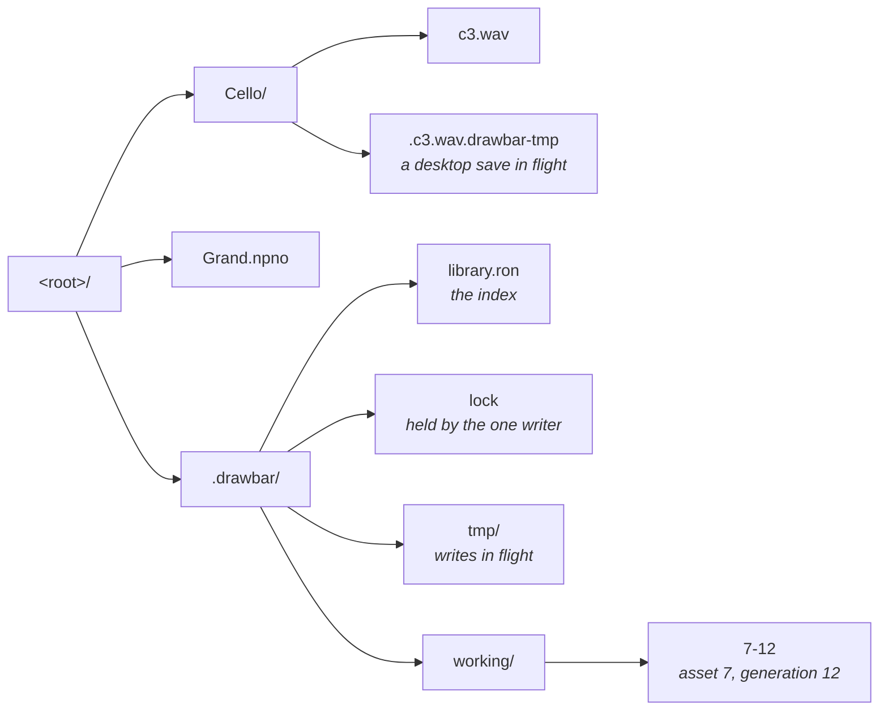
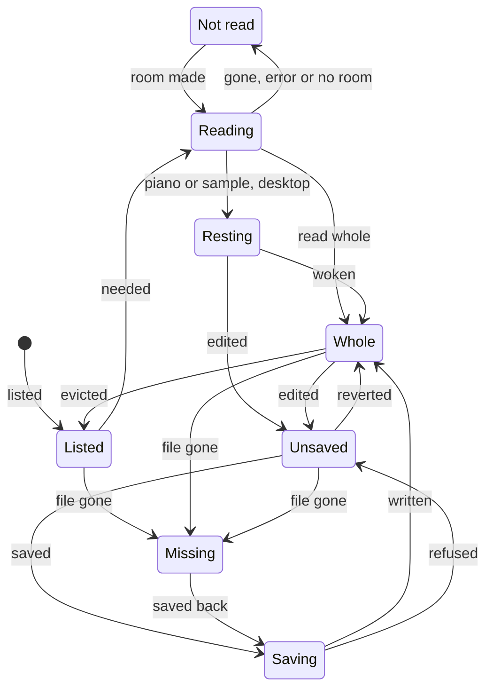
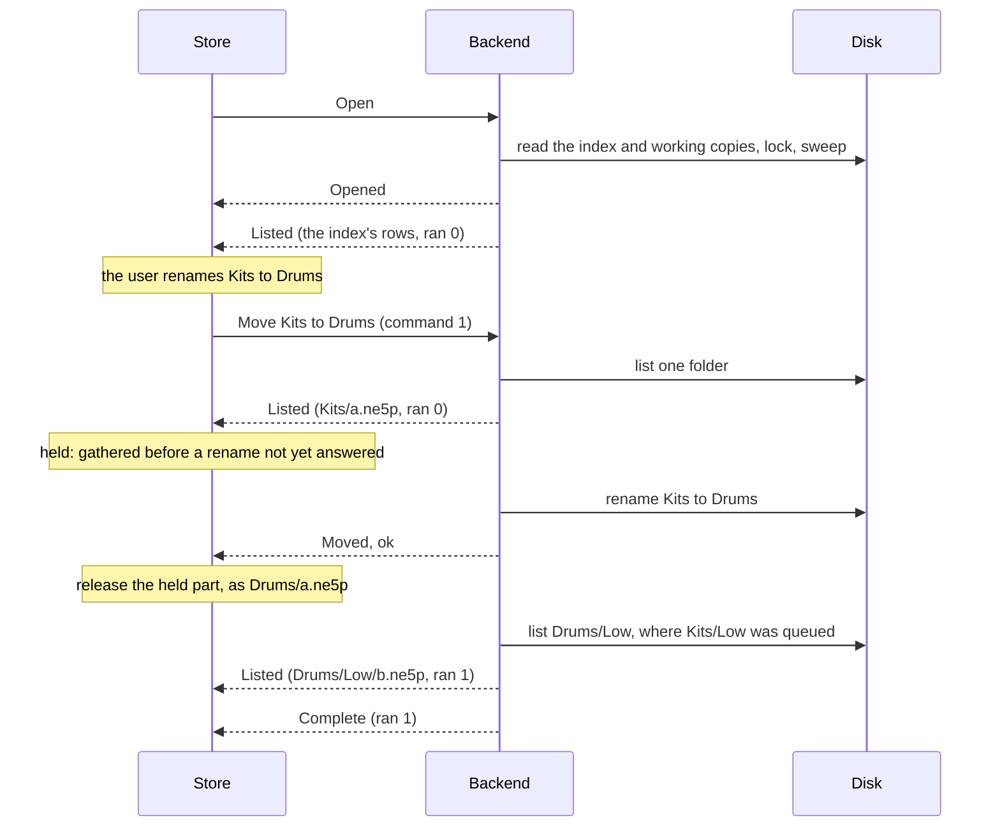
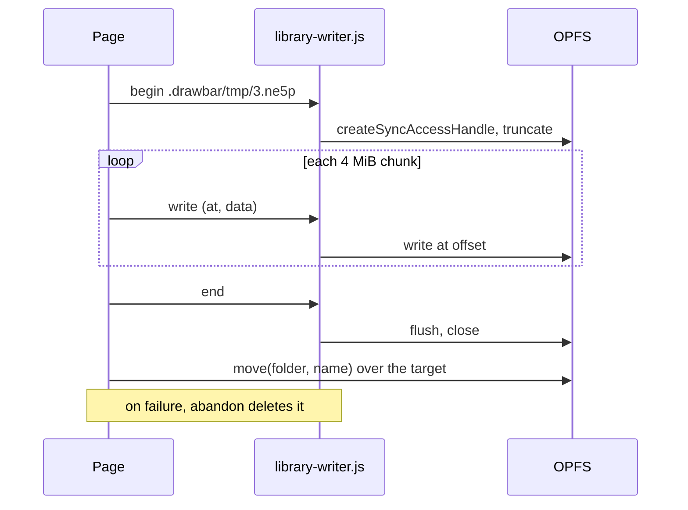
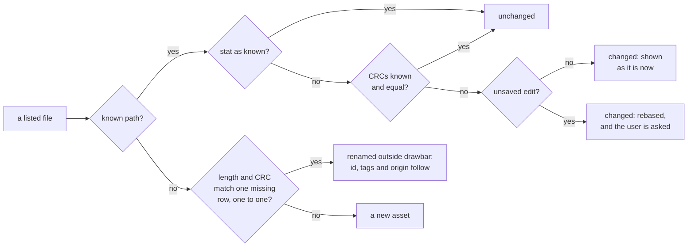

# Library data model

drawbar keeps This computer as a folder of real files. This page describes how
the app models that folder, how it reads and writes it, and how it stays
consistent with changes made outside drawbar. What a user sees of it is on
[Your files](../drawbar/this-computer.md).

The code is in `crates/drawbar/src`: `store/` holds the library on disk,
`workspace.rs` the assets in memory, `folders.rs` the folder tree, and
`ondisk.rs` the files left on disk and read by range.

## The library on disk

A library is a folder tree. A folder in the browser is a directory, an asset is
a file, and a move is a rename. Any folder can be opened as a library.

- **Desktop:** the default library is `drawbar` in the user's Music folder:
  `~/Music` on macOS and Windows, the folder `xdg-user-dirs` names on Linux, or
  the home folder where there is none (`store::native::default_root`).
- **Browser:** the default library is the root of the origin private file system
  (OPFS). In browsers with `showDirectoryPicker`, the user can also pick a folder
  on the computer (`store::web::Root`).

What a file cannot say lives in a hidden `.drawbar/` folder at the root:



`.drawbar/` is made at the first write, never on open, so a folder opened and
looked at stays as it was. The default library's folder is also made at its
first write.

### The index

`.drawbar/library.ron` is one [RON](https://github.com/ron-rs/ron) file,
rewritten whole, so writing it is a single commit point. It is written in id
order, so one library always serializes to the same text
(`store/sidecar.rs`). Abridged:

```text
(
    version: 1,
    next_id: 9,
    next_generation: 13,
    tags: {
        1: "Gig",
    },
    assets: {
        7: (
            path: Some("Cello/c3.wav"),
            name: "c3.wav",
            fingerprint: Some((
                len: 88244,
                modified: Some(1727712000123456789),
                crc: Some(3735928559),
            )),
            tags: [1],
            origin: File("c3.wav"),
            working: Some(12),
        ),
    },
)
```

| Field | Meaning |
|---|---|
| `version` | The index version. This build writes 1. |
| `next_id` | The id the next new asset takes. |
| `next_generation` | The generation the next working copy is written under. |
| `tags` | Tag names, by tag id. |
| `assets` | One row per asset, by asset id. |
| `path` | Where the asset's file is, `/`-joined from the root. `None` for a view of a slot kept only as a working copy. |
| `name` | The asset's name, for a row with no path to take one from. |
| `fingerprint` | Length, modification time in nanoseconds, and CRC-32 of the file when drawbar last read or wrote it. The CRC is `None` until something has read the whole file. |
| `tags` | Tag ids. |
| `origin` | `Fresh`, `File(name)`, `Device(class, bank, slot)` or `Rescued(bank, slot)`. |
| `working` | The generation of the asset's working copy, while it holds an unsaved edit. |

A path read from the index is checked on the way in: every component must be a
real name, never empty, `.` or `..`, and never holding `/`, `\` or NUL
(`store::LibPath`). The index is a file anyone can edit, and a `..` would reach
outside the library.

The version is read first, on its own. An index with a higher version opens the
library read-only and is never rewritten, so a newer drawbar's index survives an
older one being run over it. An index that does not parse also opens the library
read-only.

### Working copies, `tmp/` and `lock`

- `working/<id>-<generation>` holds the bytes of an unsaved edit. A working copy
  is never rewritten: a new edit gets a new generation, and the old file is
  deleted once the index stops naming it.
- `tmp/` holds the temporary files of writes in flight. On the desktop that is
  only the index's own files; a library file is staged as a hidden sibling,
  `.<name>.drawbar-tmp`, so its rename never crosses a volume. In the browser
  every write is staged in `tmp/`.
- `lock` is held by the one drawbar that may write the library, so a second
  drawbar opens it read-only.

## The in-memory model

### The workspace and its assets

`Workspace` (`workspace.rs`) is the model the rest of the app edits. It holds
every asset as a `LocalEntity`. The fields that matter here:

| Field | Meaning |
|---|---|
| `id` | Names the asset to the index, the selection and the send queue. See [Ids](#ids). |
| `name` | Its name. While `path` is set, it is the path's last component. |
| `path` | Where its file is. `None` for a view, and for a kept asset not yet placed. |
| `origin` | Where it came from: a file, a slot, the New menu, or a rescue. |
| `bytes` | Its current bytes, a shared `Bytes`. Empty while it is unread or rests in its file. |
| `entity` | What the bytes decode to, boxed, or `None` before the decode or where it failed. |
| `saved` | Its `Baseline`: what it was last saved as. |
| `kept` | Whether it is on this computer, as opposed to a view of a slot. |
| `pending` | Whether an editor holds an edit not yet applied to `bytes`. |
| `stamp` | Distinct for every set of bytes this id has held. |

`Bytes` wraps an `Arc<[u8]>`. The baseline shares the allocation while the bytes
are the same, so a clean asset is held once; an edit puts new bytes in place and
never writes through the shared allocation.

A `Baseline` is what the asset was last saved as:

| Field | Meaning |
|---|---|
| `bytes` | The saved bytes, or empty where `file` or `unread` holds them. |
| `crc32` | The checksum a slot holding these bytes would report: the CRC-32 of the body without its container. `device::link` and `library::agrees` decide on it. |
| `stamp` | The stamp of these bytes. The asset is unsaved when `stamp` differs from its own, or `pending` is set. |
| `file` | The file holding these bytes, left on disk and read by range (`ondisk::OnDisk`). |
| `unread` | The file's length, while nothing has read it. |

`LocalEntity::is_unsaved` compares stamps, never bodies. Every listed row asks
it every frame, and a piano library is hundreds of megabytes.

### Ids

The workspace hands out ids from `next_id`, and the index stores rows by id, so
an asset keeps its id from session to session. When a library opens, every row
whose id is below the workspace's `next_id` takes the next free id instead
(`Store::begin`). That happens when a view of a slot was opened first, or when
another library was open before in the same window: its views stay, and their
ids must not reach an asset of the new library. A renumbered row's working copy
is written again under the new id at the next full pass, and the old one is
dropped.

### Views and kept assets

A view is a working copy of a slot on the instrument. It is not listed, has no
file, and goes when its tab closes. `Workspace::keep` promotes one into the
list, and closing the tab of a view that holds an edit, or that waits in the
send queue, promotes it instead of dropping it.

A view that holds an edit is still kept in the index, as a row with no path and
a working copy. When the library next opens, that row comes back as a file on
this computer, placed in the root, and its working copy stays until the file is
written. When another library takes the window, the views stay in the window,
so their working copies leave the library being closed (`Store::hand_over`).

## An asset's lifecycle



- **Listed.** The asset holds its file's name, length and time, and nothing
  else. Its baseline's `unread` is set, its verify state is `Reading`, and its
  kind comes from its extension.
- **Reading.** Something needs it, or the index tracks it and it is read in the
  background. A `Cmd::Read` for its file is in flight.
- **Whole.** Its bytes are in memory. They are decoded off the frame, up to eight
  jobs of 64 files or 16 MiB at once on the desktop, and one job of 16 files or
  2 MiB a frame in the browser. An act about to use the decode runs it at once
  (`Workspace::read_now`). Decoding re-encodes and compares, as for any file
  that arrives.
- **Resting.** On the desktop, a piano library or sample instrument stays in its
  file, opened and indexed. Its checksum is checked off the frame, one file at a
  time, and until then it is `Checking`. A file that fails its check is not
  sent. Each resting file holds a file handle open, so the desktop raises its
  open-file limit at start (`ondisk::raise_open_files`).
- **Unsaved.** Its stamp differs from its baseline's. At the next full pass its
  bytes are written to `working/` under a new generation.
- **Saving.** Saving moves the baseline to the current bytes, and the store
  writes the baseline to the file. A baseline that rests in its file needs no
  write. A save refused because the file changed, one that failed, and one sent
  as the library turned read-only all leave the asset unsaved again.
- **Missing.** Its file went missing while it held something precious: tags, an
  unsaved edit, the slot it came off, or a place in the send queue. Nothing
  writes its file again until it is saved, and that save creates the file anew.
  A file deleted outside drawbar that holds nothing precious leaves the list.
- **Not read.** The library could not read it. It stays unread and is not asked
  for again, except for a read refused for room, which is retried once room can
  be made.

A clean asset that is evicted goes back to Listed under a new stamp, and keeps
its baseline's `crc32`, so it still matches its slot. A change on disk to an
unread file drops that checksum, since it no longer stands for the file.

## Listing and reading

### The metadata walk

Opening a library lists every file by its name, length and time, and reads
nothing but the files under working copies (`store/exec.rs`).

1. The index's rows are looked at first, where the index says they are, in parts
   of 256, and sent before the walk begins. A row's file that is gone lends its
   length to a set the walk checks for moved files.
2. The tree is walked breadth first, one folder at a time, so the top of a large
   tree arrives first. Entries are sent in `Event::Listed` parts of 256, and the
   app folds in four parts a frame.
3. Anything under a name that starts with a dot is left out of the listing, and
   a dot folder is not entered. The `.drawbar-tmp` siblings of interrupted saves
   are gathered on the way, to be swept.
4. A listing looks at no more than 1,000,000 entries, counting files, folders and
   entries left out (`exec::MOST_ENTRIES`). A folder past that, or one that
   cannot be read, is reported as not all listed.

A file's kind is decided by its extension alone: `store::opens` matches it,
ignoring case, against the tags `nord-format` reads and drawbar's other kinds
(`browser::tagged`). Any other file is listed by name only, as one of the
folder's `others`, and shown with **Show all files**.

### Lazy reads

A listed asset is read once something needs it. `Workspace::hurry` marks it
wanted, and the store's next `poll` sends one `Cmd::Read` for all of them. Four
things call it:

- `Workspace::in_view`, for the rows the tree and the library table draw this
  frame;
- the app, every frame, for what is open in a tab or selected
  (`DrawbarApp::update`);
- the inspector, for the selection;
- an act that works from an asset's contents, which waits until each asset in
  `Act::reads` has been read (`browser/act.rs`).

An asset needed this frame or the last is not evicted.

### Background reads

Once the listing is complete, and again at each full pass, the store reads the
unread files the index tracks, whole: those with tags, a working copy or a slot
they came off (`Store::fetch_tracked`). Reading them decodes them and takes
their slot checksum, so they match their slots on the instrument before
anything shows them. They go 32 files or 16 MiB at a time, and a read the user
waits on runs after the batch in flight. A tracked file whose CRC is still
unknown, and that no background read will cover, has its CRC taken alone,
64 files or 64 MiB at a time (`Cmd::Fingerprint`), so that an outside rename
keeps its row.

### The memory budget

The assets may hold at most 1 GiB of a library's files whole
(`exec::MOST_BYTES`). The count is every asset's bytes, plus its baseline's
where they are not the same allocation, plus the listed length of every read in
flight. A file resting on disk takes none of it. In the browser nothing rests,
so pianos and samples count in full.

Each `Cmd::Read` carries the room left. The backend reads its files in order,
and answers each one that would not fit in what is left with `Failure::Room`.
The store then makes room by evicting clean assets, the least recently needed
first, and those the index tracks only after the rest (`Store::make_room`). It
evicts nothing unless that makes the room. A background read evicts only
untracked assets.

These are never evicted:

- a view, an unsaved asset, or one with a pending edit;
- one unread already, or resting in its file;
- one needed this frame or the last;
- one in the send queue;
- one with a save in flight, a working copy, or a missing file;
- one whose path is under a rename not yet answered.

A read that cannot fit even then marks the asset not read, and it is retried,
smallest first, once room can be made.

### Reading by range

On the desktop, `OnDisk::open` indexes a CBIN file whose tag is `npno` or
`nsmp` with `nord_format::formats::npno::Index` or `nsmp::Index`. Those read
only the container header, the prefix and the stroke or zone directory, and give
the byte range of each stroke's audio. A piano document reads one stroke by its
range (`OnDisk::read`), and the sample editor, which works on the whole body,
reads the file whole off the frame first (`Workspace::wake`). A file whose index
does not read is read whole, so its decode can say why.

The index does not verify the container checksum. The resting check does, in
one streaming pass that also takes the whole file's CRC-32 for its fingerprint.
The handle follows the file through a rename, and reads whatever the file holds
now if it is rewritten in place; a rescan notices that and indexes it again.

## The store protocol

`Store` (`store/mirror.rs`) is the app's side of a library. It mirrors the
workspace onto the files and folds what it hears back into it. A backend runs
what it is told against the files. They talk in `Cmd`s and `Event`s
(`store/mod.rs`), and the app never waits for an answer: the desktop backend
runs on a thread of its own, and the browser's storage answers only
asynchronously.

| Command | Answered by |
|---|---|
| `Open` | `Opened`, then `Listed` parts, then `Complete`. Only `Opened(Err)` if it failed. |
| `Scan` | `Scanned`: the whole tree again, rereading only held files whose stat moved. |
| `Check` | `Checked`: the named files again, without listing the tree. |
| `Walk(dir)` | `Walked`, once `dir` is listed whole ahead of the rest of an open. |
| `Read` | `Read`: each file, held whole or resting, or why not. |
| `Fingerprint` | `Fingerprinted`: the CRCs of files whose stat has not moved. |
| `Save` | `Saved`: the new fingerprint, or why not. |
| `Move` | `Moved`: whether the rename happened. |
| `Commit`, `MakeDir`, `RemoveFile`, `RemoveDir` | Only `Failed`, on failure. |

Every command that writes first makes `.drawbar/` and takes the lock. Where it
cannot, it runs no further and is answered by `Event::ReadOnly`.

Both backends implement one async trait, `exec::Fs`: list a folder, stat, read,
create, replace, rename, make and remove. `exec::run` executes every command
against it, so the protocol's behavior is one piece of code. The desktop's
calls finish before they return, and `exec::execute` blocks on them on the
backend's thread (`store/native.rs`). The browser runs them in a task of its own
on the page's thread (`store/web.rs`).

### Ordering

Commands run in the order sent, each after the one before. An open's listing can
take a long time, so the commands sent while it is in flight run between two of
its folders, and the rest of the listing follows what they did:

- A rename moves the folders still to be listed, and a file it moved is not
  listed again at its new path.
- A file a save wrote is not listed again.
- A folder made or removed is added to or dropped from the walk.
- A `Walk(dir)` moves `dir` and what is in it to the front of the queue. A
  folder's removal waits on it, since the folder must be listed whole before the
  app knows it is empty.

Each `Listed` part carries `ran`: how many commands sent since the open had run
when it was gathered. A part gathered before a rename names what the rename
moved by its old path. The store counts the commands it sends, so it can bring
such a path to where it is now. It does so only once the rename has answered
`Moved` with success; until then, every part gathered before it is held back, in
order (`Loading::waits`). A rename that failed leaves the paths where they were.



A change that depends on a rename not yet answered is not sent until it
answers. Were the rename refused, the change would act on whatever else has that
name on disk. `Store::sync` holds back the first folder change that touches an
unsettled rename, and every change after it, and holds a file's save or move
into or out of such a folder for the next sync.

While a rescan is in flight, `Store::sync` sends nothing. The rescan's listing
must describe the files as the commands before it left them, or a file moved
after it was sent would read as one deleted and another made.

## Writes and crash safety

Every write rests on two operations of `Fs`. `create` writes a new file and
appears whole or not at all, refusing a name already taken. `replace` writes
over a file, and after it, or after a crash at any point, the path holds the old
contents or the new, never part of either.

### On the desktop

`replace` writes the temporary file, syncs it to the disk, renames it over the
target, and then syncs the target's folder, so the rename survives a power cut
as well as a crash. `create` does the same with a hard link in place of the
rename, because a link refuses a name already taken; on a volume without links
it falls back to a check and a rename. A rename is refused where another entry
is at the target, except a rename that only changes case, which finds the entry
itself there. Folder syncs run on Unix only.

### The order of a pass

`Store::sync` brings the files level with the workspace. A `Pass::Files` writes
the files at once, on any frame that changed the list. A `Pass::Full` also
writes the working copies and the index, at most every 2 seconds and on
eframe's 5-second autosave. At exit, `Store::close` waits for the saves and
renames in flight, then runs a `Pass::Last`, repeating until nothing more is
sent, so the last index carries every save's fingerprint. One pass sends, in
order:

1. the folder changes, except removals;
2. each asset's new file, rename, or save;
3. the deletions of assets gone from the workspace;
4. the folder removals, once what was in them has moved;
5. one `Commit`: the new working copies, then the index, then the deletions of
   the working copies the index no longer names.

So a working copy exists before an index names it, and is deleted only after
the index stops naming it. An unsaved edit's working copy is dropped only once
its save has answered. A crash after a save lands and before the next index
leaves a working copy equal to the file, and the next open sees that and does
not count the asset as unsaved.

A save over a file sends the file's fingerprint and lands only where the file
still holds it: its stat is the one taken, or else its CRC is. A file that moved
or changed answers `Failure::Moved`, the edit stays unsaved, and a rescan
follows. A deletion checks the same way, and a file that changed is left. A
save of a new file that finds its name taken puts the asset under a free name
in the library's top level at the next sync.

The index is written only once it holds something no file says (tags, a
working copy, or a slot an asset came off), or once drawbar has written to the
library. An unchanged index is not written again.

### Opening, the lock and read-only

Opening reads the index before anything is written. Where `.drawbar/` exists and
the library may be written, the open takes the lock and sweeps: everything in
`tmp/`, every working copy the index does not name, and, once the walk has
found them, the `.drawbar-tmp` siblings. A library drawbar has never written
holds nothing to sweep, and its lock is taken at the first write.

On the desktop the lock is an exclusive `File::try_lock` on `.drawbar/lock`,
held for as long as the backend lives. A library opens read-only when its index
is newer or does not read, when a working copy the index names does not read, or
when another drawbar holds the lock. A write can also find the library closed
to it later: another drawbar took the lock first, or `.drawbar/` could not be
made. Then the library turns read-only, every save in flight counts as unsaved
again, and edits stay in memory. An open that fails outright keeps nothing.

### In the browser

Files in the private file system are written by
`crates/drawbar/library-writer.js`, a dedicated worker, because the sync access
handles that write in place exist only in workers. The page drives it with one
request at a time, each answered once:

| Request | Does |
|---|---|
| `lock` | Hold `.drawbar/lock` open for as long as the worker lives. False when another worker holds it. |
| `begin` | Create or empty a file and hold it open for writing. |
| `write` | Write a transferred `ArrayBuffer` at an offset. |
| `end` | Flush the file and let it go. |
| `abandon` | Let a file go, if it is held, and delete it. |



Every file is staged under `.drawbar/tmp/` with its target's extension, since
Chrome reads a file moved to a new extension whole, for a Safe Browsing check,
before the move lands. Then `move(folder, name)` puts it in place, replacing a
file already there. In a picked folder the page writes through
`createWritable`, which applies to the file only as the stream closes, and a
Web Lock named for the folder, taken with `ifAvailable`, keeps a second tab to
reading. Reads go through `File` snapshots in 4 MiB slices.

Three things differ from the desktop. `create` checks the name and then moves,
in two steps, so in a picked folder another program can write between them.
Chrome cannot move a folder whole, so a folder moves file by file, and an
interrupted move leaves its files split between the two names, none lost. And
the browser reads every file whole: nothing rests by range. The first write to
the private file system also asks the browser to keep it through a shortage of
space. A tab opens a new library only once the one before it has run its last
command and let go of its lock.

## Fingerprints, reconciliation and conflicts

A fingerprint is a file's length and modification time, nanoseconds on the
desktop and milliseconds in the browser, plus a CRC-32 once something has read
the whole file (`store::Fingerprint`). Length and time are trusted: a file whose
stat is the one taken holds what it held. Where they moved, the CRC decides,
and a fingerprint without one says only that the file is not known to be the
same.

The CRC is taken only where the contents decide something:

- matching a file at a new path to a row whose file went missing;
- checking that a file still holds what drawbar read before a save or deletion
  over it;
- the resting check of a piano or sample instrument, and any whole read;
- in the background, for tracked rows that lack one.

### When drawbar looks again

The store rescans when the window comes back into focus, and before a send to
the instrument, which waits for the answer and goes ahead only if nothing in the
send queue changed on disk (`Store::hold_send`). It also rescans after a
failure that may mean the disk changed: a save refused because the file
changed, a refused rename, a failed command, or a read of a file that is gone.
While an open's listing is in flight, a rescan looks only at the files read so
far (`Cmd::Check`), and the full rescan follows once the listing is complete.

A rescan rereads a file drawbar holds only where its stat moved. An unread
file's new stat replaces its fingerprint, and nothing reads it.

### Matching

`store::diff::match_files` decides which file is which asset:



A row whose file is nowhere, and that no new file matches, has vanished. One
with nothing precious leaves the list as deleted outside drawbar. One with tags,
an unsaved edit, a slot it came off or a place in the queue stays, marked
missing. At open, a vanished row with a working copy comes back from that copy,
marked missing, and one without a copy but with something precious is kept in
the index as a lost row, shown as missing.

At open, a new file can be a row moved only where its length is that of a row
not found whose CRC is known. Such a file is listed as an asset of its own, and
once the walk ends, its CRC is taken a few files at a time. It then gives itself
up to the row it matches, unless it was edited or queued meanwhile, and its tags
move to the row.

### Conflicts

A file changed on disk under an unsaved edit is rebased: the file's contents
become the baseline, and the edit stays. The user is then asked:

- **Keep mine** leaves it so. The next save writes the edit over the file, whose
  new fingerprint it now expects.
- **Take theirs** reverts to the new baseline.
- **Keep both** writes the edit as a new file beside it under a free name, and
  reverts the original.

At open, a file that changed under a working copy raises the same question,
unless the working copy holds what the file now holds.

## Names

A library can be copied between macOS, Windows and Linux, so every name drawbar
creates follows the strictest rule of the three (`store/names.rs`). A name is
refused when it is empty, `.` or `..`; holds `/ \ : * ? " < > |` or a control
character; starts or ends with a space; starts with a dot, which hides it; ends
with a dot, which Windows drops; is a Windows device name such as `CON` or
`LPT1`, in any case and with any extension; or is longer than 255 bytes of
UTF-8.

A name the user typed is refused with its reason. A name the app chose is made
to fit instead (`names::portable`): forbidden characters become `-`, control
characters go, spaces and dots are trimmed from the ends, a device name gains a
leading `_`, and an overlong name is cut, keeping its extension.

Two names in one folder collide when they are equal lowercased by Unicode's
mapping (`names::key`), since APFS and NTFS compare names without case. No
normalization form is applied, so a precomposed `é` and `e` with a combining
accent are two keys. A free name is numbered before the extension: `c3 2.wav`,
then `c3 3.wav` (`names::free`).

Where a name is taken, `Folders::clash` says by what: an asset, a folder, a lost
row, or a file drawbar does not hold. The user chooses **Overwrite**, offered
only where the occupant is an asset with nothing unsaved, which writes the new
contents into its file and keeps its tags; **Keep both**, under the free name;
or **Cancel**. A folder already holding two entries under one key refuses the
name outright. Such duplicates, found on a disk that tells case apart, are
flagged and logged and never renamed, since either name may be the one other
files refer to.

## What lives where

| What | Desktop | Browser |
|---|---|---|
| Library files | The library folder | The private file system's root, or the picked folder |
| Index, working copies, temporary files, lock | `.drawbar/` in the library | `.drawbar/` in the library |
| Theme, docks, Show all files | eframe's store: `app.ron` in the app's data folder | eframe's store, in local storage |
| MIDI on or off, recent libraries | eframe's store (`drawbar.midi`, `drawbar.libraries`) | |
| Recent picked folders, as handles | | IndexedDB: database `drawbar`, store `libraries`, key `recent` |

A preference is never kept in a library, and a library is never kept in
preferences. A folder handle can be kept only in IndexedDB, and it comes back
without its permission, so the browser asks again on a click
(`libraries/web.rs`).

Earlier versions kept the library in eframe's store under
`drawbar.this_computer`, `drawbar.folders` and `drawbar.tags`. Nothing reads
those keys now. At start, any that holds something is emptied, without a word
to the user (`store::leave_behind`). eframe's store has no remove, and on the
desktop it writes back whatever it holds in memory, so emptying is the way to
clear one.

## The derived cache

> Placeholder: this section will describe the per-file summary cache, kept
> beside `app.ron` on the desktop and in IndexedDB in the browser.
